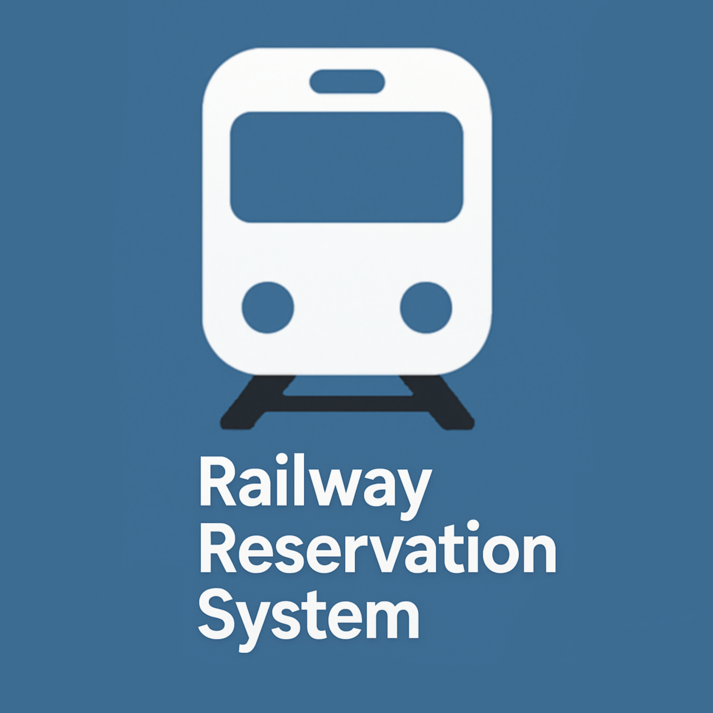

# 🚆 Railway Reservation System – Relational Database Project
 
 
An end-to-end **relational database system** simulating the operations of a **railway reservation portal**, built using **SQL (SQLite)**. This project was developed as part of **CSE 3330: Database Systems and File Structures.** at **The University of Texas at Arlington** (Fall 2024).

The goal of this project is to apply core relational database principles to design, create, and manage a system that emulates how modern railway booking systems operate behind the scenes. It provides robust functionality for tracking **passenger bookings**, **train statuses**, **travel schedules**, and **ticket types**, all while supporting complex data queries to extract insights for decision-making.

Key project components include:

- 🛠️ **Schema Design**: Based on an Entity-Relationship (ER) model, we implemented normalized tables to capture passenger info, ticket types, train records, statuses, and reservations.
- 📥 **Data Loading**: Bulk data loading was performed using SQL `INSERT INTO` statements sourced from CSV files.
- 🔍 **SQL Queries**: A comprehensive set of SELECT statements answers real-world questions such as “Which passengers have upcoming bookings?”, “Which trains are delayed?”, and “How many people booked sleeper class?”.
- 🧾 **Reporting & Results**: Query results were reviewed to validate the system's effectiveness, and final reports were submitted to reflect system behavior and database accuracy.

> 🎯 **Project Objective**  
> To demonstrate strong understanding of **database schema design**, **relational modeling**, and **query execution** by building a fully functional mini-RDBMS mimicking a real-world railway ticketing environment.

---

## 🗃️ Database Tables Overview

This section provides a detailed breakdown of the relational schema used in the Railway Reservation System. The schema includes four core tables: `Passenger`, `Train`, `Booked`, and `Train_Status`. Each table plays a distinct role in modeling passenger details, train information, booking records, and train availability status.

---

<details>
<summary><strong>👤 Passenger</strong></summary>

**Purpose:**  
Stores personal and demographic details of railway passengers.

**Attributes:**
- `SSN` (INTEGER, **Primary Key**): A unique social security number used to identify each passenger.
- `First_Name` / `Last_Name` (VARCHAR): Passenger's full name.
- `Address` (VARCHAR): Street address of the passenger.
- `City` (VARCHAR): City in which the passenger resides.
- `County` (VARCHAR): The regional subdivision or county of the passenger’s residence.
- `Phone2` (CHAR): Secondary contact phone number.
- `Birth_Date` (DATE): The date of birth used to calculate age or eligibility.

</details>

<details>
<summary><strong>🚆 Train</strong></summary>

**Purpose:**  
Stores static information about trains in the railway system.

**Attributes:**
- `Train_Number` (INTEGER, **Primary Key**): Unique identifier for each train. Must be between 1 and 5.
- `Train_Name` (VARCHAR): The name of the train (e.g., Amtrak Express).
- `Premium_Fair` (FLOAT): Fare for premium-class tickets.
- `General_Fair` (FLOAT): Fare for general-class tickets.
- `Source_Station` / `Destination_Station` (VARCHAR): Represents the train route.
- `Available_Weekdays` (VARCHAR): Comma-separated list of weekdays when the train operates.

</details>

<details>
<summary><strong>🎟️ Booked</strong></summary>

**Purpose:**  
Tracks bookings made by passengers, including class type and booking status.

**Attributes:**
- `Passenger_SSN` (INTEGER, **Foreign Key** → Passenger.SSN): Links the booking to a passenger.
- `Train_Number` (INTEGER, **Foreign Key** → Train.Train_Number): Links the booking to a train.
- `Ticket_Type` (VARCHAR): Indicates the booking class. Allowed values are:
  - `'Premium'`
  - `'General'`
- `Status` (VARCHAR): Represents the booking status. Allowed values are:
  - `'Booked'`: Successfully reserved
  - `'WaitL'`: On waiting list
- **Primary Key:** Composite of (`Passenger_SSN`, `Train_Number`)

</details>

<details>
<summary><strong>📅 Train_Status</strong></summary>

**Purpose:**  
Stores the daily seat availability and occupancy statistics for each train.

**Attributes:**
- `Train_Date` (DATE): The calendar date for which the status applies.
- `Train_Name` (VARCHAR): The name of the train (not foreign-keyed but assumed consistent with `Train` table).
- `Premium_Seats_Available` / `General_Seats_Available` (INTEGER): Number of seats available in each class.
- `Premium_Seats_Occupied` / `General_Seats_Occupied` (INTEGER): Number of booked/occupied seats.
- **Primary Key:** Composite of (`Train_Name`, `Train_Date`)

</details>

---

## 🧰 Technologies & Tools Used

### 💻 Languages


### 🧪 Tools & Frameworks


### 📚 Libraries
  
Used for reading and interpreting CSV files if needed in preprocessing or visualization phases.

### 🧠 Methodologies


These technologies supports the creation of a relational database from conceptual design (ERD) to implementation, query development, and results interpretation.

---
## 📥 Data Loading Overview

After defining the database schema, the next step involves populating the tables with actual records using the script `Load_Data_RailwaySystem.sql`. This SQL script inserts values from the corresponding CSV files into their respective tables in a consistent and relationally sound order.

---

### 📂 CSV File → SQL Table Mapping

| CSV File                   | Corresponding Table | Purpose                                             |
|----------------------------|---------------------|-----------------------------------------------------|
| `Passenger_Table_Data.csv` | `Passenger`         | Loads passenger details including SSN, name, contact, etc. |
| `Train_Table_Data.csv`     | `Train`             | Inserts data about trains like names, fares, routes |
| `TrainStatus_Table_Data.csv` | `Train_Status`     | Inserts seat availability by date and class         |
| `Booked_Table_Data.csv`    | `Booked`            | Links passengers to trains and records booking type/status |

---

### 🛠️ Script Execution Order

To preserve foreign key constraints and referential integrity, the tables must be loaded in this order:

1. `Passenger`
2. `Train`
3. `Train_Status`
4. `Booked`

---

### 📝 Important Notes

- **Date Format**: Dates in the dataset follow the `YYYY-MM-DD` format.
- **SSN**: Treated as a unique integer identifier for passengers.
- **Train Numbers**: Checked to fall within range 1–5 as per schema constraints.
- **Seats**: Values are validated to be within bounds (0–10) for each class.
- **Ticket Types**: Only `Premium` and `General` are accepted.
- **Booking Status**: Only `Booked` or `WaitL` (waitlist) entries are allowed.

You can execute the loading script as follows (in a SQL environment like SQLiteStudio):

```sql
.read Load_Data_RailwaySystem.sql
```

This command will load and populate all four tables sequentially with the provided data.

---


## 📌 SQL Query Examples & Use Cases

Below are real SQL queries used to retrieve data from the Railway Reservation System database.

<details>
<summary><strong>🔍 1. Retrieve trains booked by a specific passenger</strong></summary>

```sql
SELECT Train.Train_Number, Train.Train_Name
FROM Passenger
JOIN Booked ON Passenger.SSN = Booked.Passenger_SSN
JOIN Train ON Booked.Train_Number = Train.Train_Number
WHERE Passenger.First_Name = 'InsertFirstName' AND Passenger.Last_Name = 'InsertLastName';
```
</details>

<details>
<summary><strong>📅 2. List passengers traveling on a specific day with confirmed tickets</strong></summary>

```sql
SELECT Passenger.First_Name, Passenger.Last_Name
FROM Passenger
JOIN Booked ON Passenger.SSN = Booked.Passenger_SSN
JOIN Train ON Booked.Train_Number = Train.Train_Number
WHERE Booked.Status = 'Booked' AND Train.Available_Weekdays LIKE '%InsertDay%';
```
</details>

<details>
<summary><strong>🎟️ 3. Display train and passenger details for passengers aged 50–60</strong></summary>

```sql
SELECT Train.Train_Number, Train.Train_Name, Train.Source_Station, Train.Destination_Station, 
       Passenger.First_Name, Passenger.Last_Name, Passenger.Address, 
       Booked.Ticket_Type, Booked.Status
FROM Passenger
JOIN Booked ON Passenger.SSN = Booked.Passenger_SSN
JOIN Train ON Booked.Train_Number = Train.Train_Number
WHERE strftime('%Y', 'now') - strftime('%Y', Passenger.Birth_Date) BETWEEN 50 AND 60;
```
</details>

<details>
<summary><strong>🚆 4. List train name, date, and passenger count</strong></summary>

```sql
SELECT Train.Train_Name, Train_Status.Train_Date, 
       Train_Status.Premium_Seats_Occupied + Train_Status.General_Seats_Occupied AS Total_Passengers
FROM Train
JOIN Train_Status ON Train.Train_Name = Train_Status.Train_Name;
```
</details>

<details>
<summary><strong>✅ 5. Get confirmed passengers for a specific train</strong></summary>

```sql
SELECT Passenger.First_Name, Passenger.Last_Name
FROM Passenger
JOIN Booked ON Passenger.SSN = Booked.Passenger_SSN
JOIN Train ON Booked.Train_Number = Train.Train_Number
WHERE Train.Train_Name = 'EnterTrainName' AND Booked.Status = 'Booked';
```
</details>

<details>
<summary><strong>🕓 6. List all waitlisted passengers and their train name</strong></summary>

```sql
SELECT Passenger.First_Name, Passenger.Last_Name, Train.Train_Name
FROM Passenger
JOIN Booked ON Passenger.SSN = Booked.Passenger_SSN
JOIN Train ON Booked.Train_Number = Train.Train_Number
WHERE Booked.Status = 'WaitL';
```
</details>

<details>
<summary><strong>📞 7. Passengers with phone area code '605' (descending order)</strong></summary>

```sql
SELECT First_Name, Last_Name
FROM Passenger
WHERE Phone2 LIKE '605%'
ORDER BY First_Name DESC, Last_Name DESC;
```
</details>

<details>
<summary><strong>📆 8. Passengers traveling on Thursdays (ascending order)</strong></summary>

```sql
SELECT Passenger.First_Name, Passenger.Last_Name
FROM Passenger
JOIN Booked ON Passenger.SSN = Booked.Passenger_SSN
JOIN Train ON Booked.Train_Number = Train.Train_Number
WHERE Train.Available_Weekdays LIKE '%Thursday%' AND Booked.Status = 'Booked'
ORDER BY Passenger.First_Name ASC;
```
</details>

# 🛠️ Database Design & Relationships

The Railway Reservation System project follows a normalized relational schema using four core entities that are connected via primary and foreign key constraints. The schema design ensures data integrity and supports a range of queries related to train travel, bookings, and passengers.

---

## 🔗 Entity Relationships

### 👤 Passenger
- **Primary Key:** `SSN`
- Contains personal information such as name, address, city, phone, and birth date.
- Serves as a parent table in the `Booked` relationship.

### 🚆 Train
- **Primary Key:** `Train_Number`
- Stores details like train name, source/destination stations, fare types, and operating weekdays.
- Acts as a parent in both the `Booked` and `Train_Status` tables.

### 🎫 Booked
- **Composite Primary Key:** (`Passenger_SSN`, `Train_Number`)
- **Foreign Keys:** 
  - `Passenger_SSN` → `Passenger.SSN`
  - `Train_Number` → `Train.Train_Number`
- Captures ticket details for each passenger, including ticket type and booking status (Booked or Waitlisted).

### 📅 Train_Status
- **Composite Primary Key:** (`Train_Name`, `Train_Date`)
- Tracks seat availability and occupancy per train per date.
- Includes fields for premium/general seat counts.
- `Train_Name` links indirectly with the `Train` table.

---

## 🧩 Summary of Relationships

- A **Passenger** can book **multiple Trains** → _One-to-Many_
- A **Train** can have **many Passengers** booked → _One-to-Many_
- **Train_Status** tracks operational details per **Train** on specific **Dates**
- The system uses **composite keys** to manage many-to-many relations and time-specific data

```
Passenger --< Booked >-- Train --< Train_Status
```

Each connection supports referential integrity and enables complex SQL queries such as:
- Who is traveling on a specific day?
- How many premium seats are booked for a train?
- Which trains are passengers between age 50–60 booked on?

---

This schema promotes scalability, modular query writing, and efficient data handling across the reservation workflow.

## 🔍 Query Optimization & Indexing

To ensure efficient performance and data integrity within the Railway Reservation System database, several indexing and optimization techniques were applied:

### 🔑 Primary & Composite Keys

- **Passenger Table**
  - `SSN` was chosen as the **primary key** to uniquely identify each passenger and speed up lookups involving bookings or passenger queries.

- **Train Table**
  - `Train_Number` was selected as the **primary key** since it's the most reliable identifier for train entries and facilitates fast JOIN operations.

- **Train_Status Table**
  - A **composite key** (`Train_Name`, `Train_Date`) was used to represent the unique status of a train on a specific day, enabling precise and indexed searches for availability and occupancy.

- **Booked Table**
  - Composite primary key on (`Passenger_SSN`, `Train_Number`) ensures that a passenger can only be booked once per train, and enforces integrity on cross-referenced data.

---

### 📏 Data Constraints for Integrity

- **Check Constraints**
  - `Ticket_Type` limited to `'Premium'` or `'General'`
  - `Status` limited to `'Booked'` or `'WaitL'`
  - Numeric bounds on `Seats_Available` and `Seats_Occupied` (0–10) in `Train_Status` to simulate realistic booking limits

- **Foreign Keys**
  - Enforced between:
    - `Booked` ↔ `Passenger` (via `Passenger_SSN`)
    - `Booked` ↔ `Train` (via `Train_Number`)
    - `Train_Status` ↔ `Train` (via `Train_Name`)
  - Ensures all booking and status entries point to valid entities.

---

### 🔁 Query Performance Improvements

- **JOIN Optimization**
  - Use of indexed primary keys enables faster JOINs between `Passenger`, `Booked`, and `Train`.
  - Joins leverage SSN and Train_Number lookups, avoiding full table scans.

- **Normalized Schema**
  - Proper decomposition of tables reduces redundancy (e.g., separating `Train_Status` from `Train`)
  - Simplifies data updates and reduces inconsistency risk.

- **Selective Filtering**
  - WHERE conditions like `Status = 'Booked'` and `Available_Weekdays LIKE '%Thursday%'` use indexed fields for faster subset retrieval.

---

By applying these indexing and optimization strategies, the system maintains fast performance and consistent data handling, even as more records are added.

## 🧩 Entity-Relationship Diagram (ERD)

The **Entity-Relationship Diagram (ERD)** provides a visual summary of the database structure for the Railway Reservation System. It identifies how entities (tables) are interrelated through foreign keys and primary keys.

---

### 🔗 Entities & Relationships

| Entity          | Description                                                                 |
|------------------|-----------------------------------------------------------------------------|
| **Passenger**     | Stores information about passengers, including SSN, name, and contact data. |
| **Train**         | Contains details about trains such as route, name, and fares.              |
| **Booked**        | Connects passengers and trains, tracks booking status and ticket type.     |
| **Train_Status**  | Holds daily seat availability and occupancy for each train.                |

---

### 📘 Relationships Overview

- `Passenger` **1 → M** `Booked`  
  → One passenger can have multiple bookings.

- `Train` **1 → M** `Booked`  
  → Each train can be booked by multiple passengers.

- `Train` **1 → M** `Train_Status`  
  → Each train has a status for each date it runs.

#### 🔒 Foreign Key Constraints

- `Booked.Passenger_SSN` → `Passenger.SSN`
- `Booked.Train_Number` → `Train.Train_Number`
- `Train_Status.Train_Name` → `Train.Train_Name`

---

### 🗝️ Primary Keys

- **Passenger**: `SSN`  
- **Train**: `Train_Number`  
- **Booked**: Composite → (`Passenger_SSN`, `Train_Number`)  
- **Train_Status**: Composite → (`Train_Name`, `Train_Date`)
  
---

## 🎓 Learning Outcomes

This Railway Reservation System project offered valuable hands-on experience with designing, implementing, and querying a relational database system. Below is a summary of the key academic and technical takeaways from this project:

---

### 🧩 ERD Modeling
- Gained a deeper understanding of how to design entity-relationship diagrams (ERDs) to reflect real-world systems.
- Practiced converting ERDs into normalized table schemas using primary and foreign keys.

### 🧠 SQL Joins, Constraints, and Queries
- Developed complex SQL queries using multiple joins across four interrelated tables.
- Implemented and tested constraints like `CHECK`, `NOT NULL`, and `PRIMARY KEY` to enforce data integrity.
- Used pattern matching, subqueries, and filtering logic effectively.

### 🗃️ Relational Schema Design
- Understood how to design a normalized schema to avoid redundancy and improve query performance.
- Structured many-to-many relationships using composite keys (e.g., `Booked` and `Train_Status` tables).

### 🔧 Data Loading & Debugging
- Used `.csv` files and `INSERT` scripts to load real data into the database.
- Debugged schema violations and refined SQL logic through iterative testing.
- Verified referential integrity and ensured all queries returned accurate results.

---

This project served as a comprehensive introduction to practical database management and helped reinforce theoretical concepts through meaningful implementation.

## 🚀 Future Enhancements

While the current implementation of the **Railway Reservation System** project meets the outlined requirements, several features could enhance its functionality and scalability:

- **🧾 E-Ticket Generation**  
  Implement functionality to generate and export digital tickets as PDF files after successful bookings.

- **📅 Calendar-Based Travel Selection**  
  Allow passengers to pick travel dates using an integrated calendar UI for better user interaction.

- **🔐 User Login & Role Management**  
  Introduce login roles (e.g., Admin, Passenger) to separate data access levels and add security.

- **📊 Dashboard Analytics**  
  Provide administrative dashboards for monitoring seat occupancy trends, cancellation rates, and peak travel times.

- **🌐 Web-Based Front-End**  
  Build a responsive web interface using Flask/Django or React to enable real-time interaction with the database.

- **📦 Normalize Train Status Data Further**  
  Separate seat types into a different table to reduce redundancy and improve data consistency.

---

## 🙏 Thank You

Thank you for taking the time to explore the **Railway Reservation System** project!

This project served as a valuable hands-on experience in database schema design, SQL query building, data normalization, and entity relationship modeling.  
We hope it provides insight into relational database structures and serves as a useful reference for academic or development use.

Feel free to ⭐ star, fork, or contribute — and happy querying! 🚂💻


